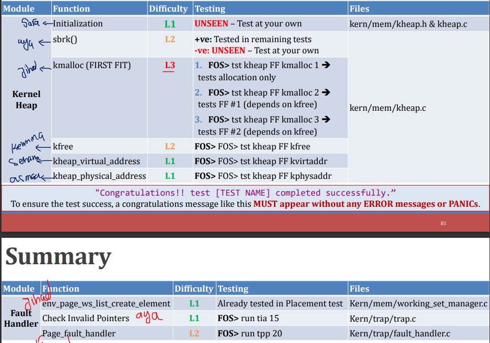

# OS_Academic_proj
# Operating_system

### Problem Definition and requirement :-

**Milestone 1**  of the project aims to implement a dynamic memory allocator for an operating system. The allocator should manage the heap memory using a linked list data structure where each allocated block of memory is preceded by a header containing metadata.  The allocator must efficiently manage the allocation and deallocation of memory to optimize the use of available space and ensure proper handling of different memory management scenarios.

**Milestone 2** of this project focuses on enhancing the memory management capabilities within an operating system. Specifically, this involves the implementation of several critical components:

1.  **Kernel Heap**: Developing a block and page allocator to manage dynamic memory allocation within the kernel space efficiently.
2.  **User Heap**: Implementing functions to handle dynamic memory allocation in user space, ensuring proper memory allocation and deallocation using a first-fit strategy.
3.  **Fault Handler**: Creating a fault handler to manage page faults, ensuring that invalid memory accesses are properly handled without harming the kernel or other processes.

These components are essential for improving the system's ability to manage memory dynamically and handle memory access errors gracefully, thus enhancing overall system stability and performance.

**Milestone 3**
 

### Project Requirements:
**Milestone 1**
The primary functions to be developed include initialization of the allocator, memory allocation using the First Fit strategy, and reallocation of memory blocks. 

**Milestone 2**


**Milestone 3**


### Prerequisites

Visual Studio .
project is windows form application

```
Give examples
```

### Installing
...........write if something needed to be installed


## Running the tests


### Break down into end to end tests

Explain what these tests test and why

```
Give an example
```

### And coding style tests

Explain what these tests test and why Later ......

```
Give an example
```


## Built With

* [C#](https://www.w3schools.com/cs/index.php) - Programming Language used
* [Huffman Coding](https://www.geeksforgeeks.org/huffman-coding-greedy-algo-3/) - Algorithm for compression and decompression
* [Linear Feedback Shift Register ](https://medium.com/@czapfel/an-introduction-to-lfsrs-for-cryptography-bf2602640e91) - Used to Encrypt and decrypt images 

## Authors

* **Mohanad Khaled** - *Initial work* - (https://github.com/MohanadKh03)
* **jihad^kandil**  - (https://github.com/jihadkandil2)
*  **MazenSamehR**  - (https://github.com/MazenSamehR)
*  **sehamibrahim** - (https://github.com/sehamibrahim)
* **Nour-2003**  - (https://github.com/Nour-2003)
* **hala esmail**  - (https://github.com/hala912)


See also the list of [contributors](https://github.com/jihadkandil2/image-encryption-compression/graphs/contributors) who participated in this project.
